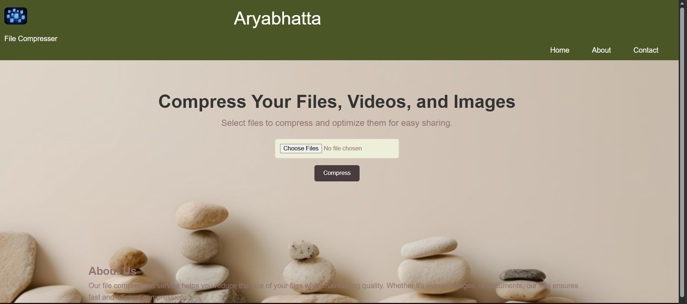

# Compression Toolkit 🗜️

## 🏆 Hackathon Achievement
**Aryabatta Hackathon 2nd Position Winner**  
*Conducted by Math Club*

This project was developed as part of the prestigious Aryabatta Hackathon and secured **2nd position** in the competition!

---

## 📋 Project Overview

**Compression Toolkit** is a powerful web-based application designed to compress various media files including images and videos. The application provides an intuitive interface for users to upload, compress, and download their files with multiple compression level options.

### How It Works



---

## ✨ Features

- **Image Compression**: Compress JPG, JPEG, and PNG files with adjustable quality levels
- **Video Compression**: Support for MP4, AVI, and MOV video formats
- **Multiple Compression Levels**: 
  - High Compression (smaller file size)
  - Medium Compression (balanced)
  - Low Compression (better quality)
- **User-Friendly Interface**: Simple drag-and-drop or file selection interface
- **Batch Processing**: Compress multiple files at once
- **Real-time Feedback**: Live status updates during compression

---

## 🛠️ Tech Stack

### Frontend
- **HTML5** - Markup structure
- **CSS3** - Styling and responsive design
- **JavaScript** - Client-side interactivity

### Backend
- **Node.js** - Runtime environment
- **Express.js** - Web framework
- **Multer** - File upload handling
- **Fluent-FFmpeg** - Video compression
- **ImageMin** - Image optimization
  - ImageMin MozJPEG - JPEG compression
  - ImageMin PNGQuant - PNG compression

---

## 📦 Installation

### Prerequisites
- Node.js (v14 or higher)
- npm (Node Package Manager)

### Setup Steps

1. **Clone or navigate to the project directory**
   ```bash
   cd "d:\Documents\norse\web Applicarion\Compressor"
   ```

2. **Install dependencies**
   ```bash
   npm install
   ```

3. **Start the server**
   ```bash
   node server.js
   ```

4. **Open in browser**
   ```
   http://localhost:3000
   ```

---

## 🚀 Usage

1. **Select Files**: Click on the file input area to choose files or drag and drop them
2. **Choose Compression Level**: Select between High, Medium, or Low compression
3. **Compress**: Click the "Compress" button to start the process
4. **Download**: Once compressed, download your optimized files

---

## 📁 Project Structure

```
Compressor/
├── index.html          # Main HTML page
├── style.css           # Styling
├── main.js             # Client-side logic
├── server.js           # Backend server
├── package.json        # Project dependencies
├── image.png           # Website preview screenshot
└── README.md           # This file
```

---

## 📋 Dependencies

- `express` - Web framework
- `multer` - File upload middleware
- `fluent-ffmpeg` - FFmpeg wrapper for video processing
- `ffmpeg-static` - FFmpeg binaries
- `imagemin` - Image compression library
- `imagemin-mozjpeg` - JPEG optimization plugin
- `imagemin-pngquant` - PNG optimization plugin
- `uuid` - Unique identifier generation

---

## 🎯 How to Use the Application

### For Images
- Supported formats: JPG, JPEG, PNG
- Choose your desired compression level
- Upload and click compress
- Download the optimized image file

### For Videos
- Supported formats: MP4, AVI, MOV
- Select compression level
- Upload and wait for processing
- Download the compressed video

---

## 💡 Future Enhancements

- [ ] Support for additional file formats (GIF, WEBP, etc.)
- [ ] Compression statistics and size reduction display
- [ ] Queue management system
- [ ] User authentication
- [ ] Cloud storage integration
- [ ] Compression history

---

## 👥 Team

Developed for the **Aryabatta Hackathon** - Conducted by Math Club

**Achievement**: 🥈 2nd Position

---

## 📄 License

ISC License

---

## 📞 Support

For questions or issues, please refer to the project files or contact the development team.

---

**Happy Compressing! 🎉**
